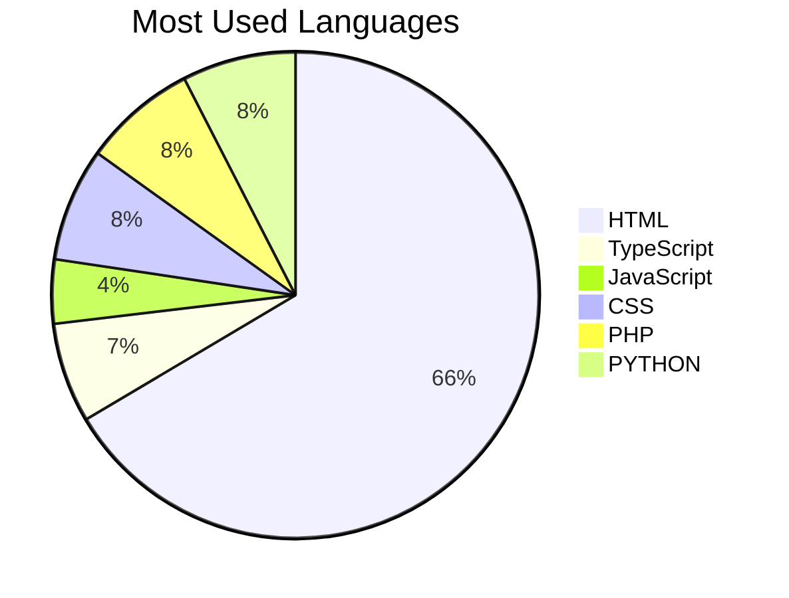

# Chamod Buddhika GitHub Profile

## Hi there 👋

### Let's Get Started

#### Chamod Buddhika's GitHub Stats

<table>
  <tr>
    <td>Total Stars Earned:</td>
    <td>0</td>
  </tr>
  <tr>
    <td>Total Commits (2024):</td>
    <td>6</td>
  </tr>
  <tr>
    <td>Total PRs:</td>
    <td>0</td>
  </tr>
  <tr>
    <td>Total Issues:</td>
    <td>0</td>
  </tr>
  <tr>
    <td>Contributed to (last year):</td>
    <td>0</td>
  </tr>
</table>

#### Most Used Languages

### About Me

- 🙋‍♂️ I'm Chamod Budhhika
- 📚 I'm 22 years old
- 💻 I'm an undergraduate pursuing a BICT Hons degree at the University of Jayewardenepura  
- 🌱 I'm following the Full Stack Developer path  
- 📢 I have experience in Java, Python, and C#  
- 🤝 I’ve created projects like a **Flappy Bird Game**, **Hand Gesture Control System**, and a **Facial Recognition System**
- 🌟 I'm passionate about Web Development, Mobile GPS features, and Robotic Process Automation (RPA)  
- 📧 Email me: [buddhikaJayaneththi765@gmail.com](mailto:buddhikajayaneththi@gmail.com)
- 📱 WhatsApp: +94702926280

